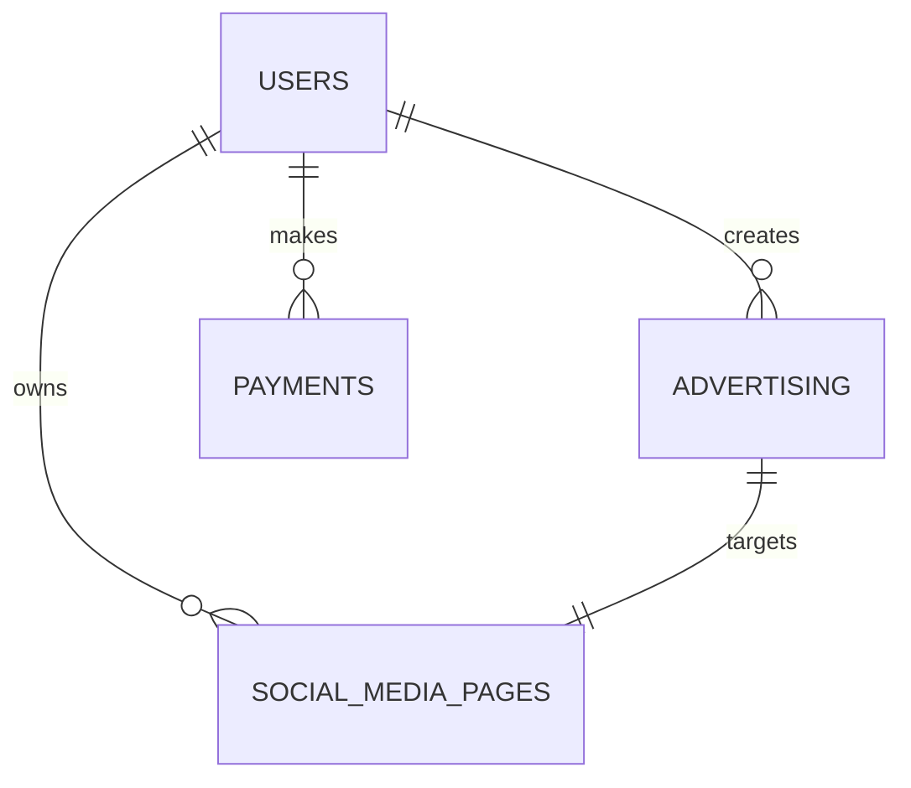

# معمارية النظام (System Architecture)

## نظرة عامة

منصة التسويق الرقمي تم تصميمها باستخدام معمارية Clean Architecture مع فصل واضح بين الطبقات. يتبع المشروع مبادئ Domain-Driven Design (DDD) ويستخدم نمط Repository للتأكد من قابلية الاختبار والصيانة.

## المعمارية العامة

```
┌─────────────────────────────────────────────────────────────┐
│                    Presentation Layer                       │
│  ┌─────────────┐ ┌─────────────┐ ┌─────────────┐           │
│  │   Web API   │ │   Mobile    │ │   Admin     │           │
│  │   (REST)    │ │    App      │ │   Panel     │           │
│  └─────────────┘ └─────────────┘ └─────────────┘           │
└─────────────────────────────────────────────────────────────┘
                              │
┌─────────────────────────────────────────────────────────────┐
│                   Application Layer                         │
│  ┌─────────────┐ ┌─────────────┐ ┌─────────────┐           │
│  │ Controllers │ │  Services   │ │    DTOs     │           │
│  │             │ │             │ │             │           │
│  └─────────────┘ └─────────────┘ └─────────────┘           │
└─────────────────────────────────────────────────────────────┘
                              │
┌─────────────────────────────────────────────────────────────┐
│                     Domain Layer                            │
│  ┌─────────────┐ ┌─────────────┐ ┌─────────────┐           │
│  │  Entities   │ │  Services   │ │ Interfaces  │           │
│  │             │ │             │ │             │           │
│  └─────────────┘ └─────────────┘ └─────────────┘           │
└─────────────────────────────────────────────────────────────┘
                              │
┌─────────────────────────────────────────────────────────────┐
│                Infrastructure Layer                         │
│  ┌─────────────┐ ┌─────────────┐ ┌─────────────┐           │
│  │  Database   │ │  External   │ │   Shared    │           │
│  │  (Drizzle)  │ │  Services   │ │  Services   │           │
│  └─────────────┘ └─────────────┘ └─────────────┘           │
└─────────────────────────────────────────────────────────────┘
```

## هيكل المشروع التفصيلي

### 1. طبقة العرض (Presentation Layer)

#### Controllers
```typescript
// مثال: UserController
export class UserController {
  constructor(
    private readonly userService: UserAppService
  ) {}

  async createUser(req: Request, res: Response): Promise<void> {
    // معالجة الطلب والاستجابة
  }
}
```

#### Routes
- **Authentication Routes**: `/api/auth/*`
- **User Routes**: `/api/users/*`
- **Advertising Routes**: `/api/advertising/*`
- **Payment Routes**: `/api/payment/*`

### 2. طبقة التطبيق (Application Layer)

#### Services
```typescript
// مثال: UserAppService
export class UserAppService {
  constructor(
    private readonly userRepository: UserRepositoryImpl,
    private readonly otpService: OTPService,
    private readonly jwtService: JwtService
  ) {}

  async createUser(input: CreateUser): Promise<ApiResponseInterface> {
    // منطق التطبيق
  }
}
```

#### DTOs (Data Transfer Objects)
```typescript
export const CreateUserSchema = createInsertSchema(users).omit({
  id: true,
  createdAt: true,
  updatedAt: true
});
```

### 3. طبقة النطاق (Domain Layer)

#### Entities
```typescript
// مثال: User Entity
export const users = pgTable('users', {
  id: varchar('id', { length: 255 }).primaryKey(),
  email: varchar('email', { length: 255 }).notNull().unique(),
  username: varchar('username', { length: 255 }),
  role: userRoleEnum('role').default('user').notNull(),
  // ... المزيد من الحقول
});
```

#### Domain Services
```typescript
export class UserDomainService {
  async validateUserCreation(userData: CreateUser): Promise<boolean> {
    // منطق التحقق من النطاق
  }
}
```

#### Repository Interfaces
```typescript
export interface userInterface {
  getUser(id: string): Promise<User | undefined>;
  createUser(user: CreateUser): Promise<User>;
  updateUser(id: string, updates: Partial<User>): Promise<User>;
}
```

### 4. طبقة البنية التحتية (Infrastructure Layer)

#### Database (Drizzle ORM)
```typescript
// Schema Definition
export const schema = {
  users,
  advertising,
  payments,
  // ... المزيد من الجداول
};

// Repository Implementation
export class UserRepositoryImpl implements userInterface {
  async createUser(user: CreateUser): Promise<User> {
    // تنفيذ الوصول للبيانات
  }
}
```

#### External Services
- **Stripe Integration**: معالجة المدفوعات الدولية
- **Paymob Integration**: معالجة المدفوعات المحلية
- **Facebook SDK**: تكامل وسائل التواصل الاجتماعي
- **Google OAuth**: مصادقة جوجل
- **Resend**: خدمة البريد الإلكتروني

## تدفق البيانات

### 1. إنشاء مستخدم جديد

```
Client Request → Controller → Service → Repository → Database
                     ↓
Client Response ← Serializer ← Service ← Repository ← Database
```

### 2. معالجة الدفع

```
Payment Request → Payment Controller → Payment Service → Stripe/Paymob
                       ↓
Webhook ← External Service ← Payment Gateway ← Stripe/Paymob
```

### 3. إدارة الإعلانات

```
Ad Request → Ad Controller → Ad Service → Facebook API
                ↓
Response ← Ad Service ← Facebook API ← Ad Controller
```

## أنماط التصميم المستخدمة

### 1. Repository Pattern
```typescript
// Interface في طبقة النطاق
export interface userInterface {
  getUser(id: string): Promise<User | undefined>;
}

// Implementation في طبقة البنية التحتية
export class UserRepositoryImpl implements userInterface {
  async getUser(id: string): Promise<User | undefined> {
    // تنفيذ الوصول للبيانات
  }
}
```

### 2. Factory Pattern
```typescript
export function createUserController(): UserController {
  const userRepository = new UserRepositoryImpl();
  const userService = new UserAppService(userRepository);
  return new UserController(userService);
}
```

### 3. Dependency Injection
```typescript
export class UserAppService {
  constructor(
    private readonly userRepository: UserRepositoryImpl,
    private readonly otpService: OTPService,
    private readonly jwtService: JwtService
  ) {}
}
```

### 4. Builder Pattern
```typescript
export class ApiResponseBuilder {
  static success<T>(data: T, message?: string): ApiResponseInterface<T> {
    return {
      success: true,
      data,
      message
    };
  }
}
```

## إدارة الأخطاء

### Error Handling Strategy
```typescript
export class ErrorBuilder {
  static build(
    code: ErrorCode, 
    message: string, 
    details?: string
  ): ApiResponseInterface<null> {
    return {
      success: false,
      error: {
        code,
        message,
        details
      }
    };
  }
}
```

### Error Codes
```typescript
export enum ErrorCode {
  USER_NOT_FOUND = 'USER_NOT_FOUND',
  INVALID_CREDENTIALS = 'INVALID_CREDENTIALS',
  USER_ALREADY_EXISTS = 'USER_ALREADY_EXISTS',
  INSUFFICIENT_PERMISSIONS = 'INSUFFICIENT_PERMISSIONS',
  INTERNAL_SERVER_ERROR = 'INTERNAL_SERVER_ERROR'
}
```

## الأمان

### 1. Authentication & Authorization
```typescript
export class AuthMiddleware {
  static middleware(requiredRole: UserRole) {
    return (req: Request, res: Response, next: NextFunction) => {
      // التحقق من JWT token
      // التحقق من الصلاحيات
    };
  }
}
```

### 2. Input Validation
```typescript
// استخدام Zod للتحقق من البيانات
export const CreateUserSchema = z.object({
  email: z.string().email(),
  password: z.string().min(8),
  username: z.string().min(3)
});
```

### 3. Rate Limiting
```typescript
const globalLimiter = rateLimit({
  windowMs: 15 * 60 * 1000, // 15 minutes
  max: 1000, // Limit each IP to 1000 requests
  message: { error: 'Too many requests' }
});
```

## قاعدة البيانات

### Schema Design
```sql
-- Users Table
CREATE TABLE users (
  id VARCHAR(255) PRIMARY KEY,
  email VARCHAR(255) UNIQUE NOT NULL,
  username VARCHAR(255),
  role user_role DEFAULT 'user' NOT NULL,
  created_at TIMESTAMP DEFAULT NOW(),
  updated_at TIMESTAMP DEFAULT NOW()
);

-- Advertising Table
CREATE TABLE advertising (
  id VARCHAR(255) PRIMARY KEY,
  title VARCHAR(255) NOT NULL,
  description TEXT,
  status ad_status DEFAULT 'pending',
  user_id VARCHAR(255) REFERENCES users(id),
  created_at TIMESTAMP DEFAULT NOW()
);

-- Payments Table
CREATE TABLE payments (
  id VARCHAR(255) PRIMARY KEY,
  amount DECIMAL(10,2) NOT NULL,
  currency currency_enum DEFAULT 'sar',
  status purchase_status DEFAULT 'pending',
  user_id VARCHAR(255) REFERENCES users(id),
  created_at TIMESTAMP DEFAULT NOW()
);
```

### Database Relationships


## التكاملات الخارجية

### 1. Stripe Integration
```typescript
export class StripeService {
  async createCheckoutSession(options: CheckoutOptions): Promise<Session> {
    return await stripe.checkout.sessions.create({
      payment_method_types: ['card'],
      line_items: options.lineItems,
      mode: 'payment',
      success_url: options.successUrl,
      cancel_url: options.cancelUrl
    });
  }
}
```

### 2. Paymob Integration
```typescript
export class PaymobPaymentHandler {
  async createCheckoutSession(options: CheckoutSessionOptions): Promise<PaymobCheckoutSession> {
    // إنشاء طلب في Paymob
    // إنشاء مفتاح دفع
    // إرجاع رابط الدفع
  }
}
```

### 3. Facebook SDK Integration
```typescript
export class FacebookSDK {
  async getPageAccessToken(userId: string): Promise<string> {
    // الحصول على رمز الوصول للصفحة
  }

  async createAd(adData: AdData): Promise<FacebookAd> {
    // إنشاء إعلان في فيسبوك
  }
}
```

## الأداء والتحسين

### 1. Caching Strategy
- **In-Memory Caching**: للبيانات المؤقتة
- **Session Storage**: لجلسات المستخدمين
- **API Response Caching**: للاستجابات المتكررة

### 2. Database Optimization
- **Indexing**: على الحقول المستخدمة بكثرة
- **Connection Pooling**: لتحسين الاتصال بقاعدة البيانات
- **Query Optimization**: لتحسين استعلامات قاعدة البيانات

### 3. Security Optimizations
- **Rate Limiting**: لمنع إساءة الاستخدام
- **Input Sanitization**: لتنظيف البيانات المدخلة
- **CORS Configuration**: لإدارة الطلبات عبر النطاقات

## المراقبة والتسجيل

### 1. Logging Strategy
```typescript
// Request Logging
app.use((req, res, next) => {
  const timestamp = new Date().toISOString();
  const ip = req.ip || req.connection.remoteAddress;
  console.log(`[${timestamp}] ${req.method} ${req.path} - ${ip}`);
  next();
});
```

### 2. Error Tracking
```typescript
// Global Error Handler
app.use((err: any, req: Request, res: Response, next: NextFunction) => {
  console.error('Error:', err);
  // إرسال الخطأ إلى خدمة المراقبة
  res.status(err.status || 500).json({
    error: 'Internal server error'
  });
});
```

## الاختبار

### 1. Unit Testing
```typescript
describe('UserService', () => {
  it('should create user successfully', async () => {
    const userData = { email: 'test@example.com', password: 'password' };
    const result = await userService.createUser(userData);
    expect(result.success).toBe(true);
  });
});
```

### 2. Integration Testing
```typescript
describe('User API', () => {
  it('should register new user', async () => {
    const response = await request(app)
      .post('/api/auth/register')
      .send({ email: 'test@example.com', password: 'password' });
    
    expect(response.status).toBe(201);
  });
});
```

## النشر والإنتاج

### 1. Environment Configuration
```typescript
export const config = {
  database: {
    url: process.env.DATABASE_URL,
    ssl: process.env.NODE_ENV === 'production'
  },
  auth: {
    jwtSecret: process.env.JWT_SECRET,
    jwtExpiresIn: process.env.JWT_EXPIRES_IN
  },
  external: {
    stripeSecretKey: process.env.STRIPE_SECRET_KEY,
    paymobApiKey: process.env.PAYMOB_API_KEY
  }
};
```

### 2. Deployment Strategy
- **Vercel**: للنشر السريع والسهل
- **Environment Variables**: لإدارة الإعدادات
- **Database Migrations**: لإدارة تغييرات قاعدة البيانات
- **Health Checks**: لمراقبة حالة النظام

---

هذه المعمارية تضمن قابلية التطوير والصيانة والأمان، مع الحفاظ على فصل الاهتمامات واستخدام أفضل الممارسات في تطوير التطبيقات الحديثة.
